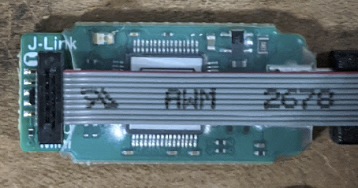

# Consolidated-Firmware

A repository for all software and firmware from UBC Formula Electric.

## Table of Contents

- [Consolidated-Firmware](#consolidated-firmware)
  - [Table of Contents](#table-of-contents)
  - [Environment Setup](#environment-setup)
    - [Install Dependencies](#install-dependencies)
    - [WSL Setup (Windows only)](#wsl-setup-windows-only)
      - [WSL USB Setup](#wsl-usb-setup)
    - [Clone Repo](#clone-repo)
  - [Using the Dev Container](#using-the-dev-container)
    - [VS Code Extensions](#vs-code-extensions)
    - [Closing the Container](#closing-the-container)
  - [Building](#building)
    - [Load CMake](#load-cmake)
    - [Build Embedded Binaries](#build-embedded-binaries)
    - [Build Tests](#build-tests)
  - [Debugging](#debugging)
    - [Embedded](#embedded)
    - [Tests](#tests)
  - [CAN Bus](#can-bus)
    - [Windows](#windows)
    - [Linux](#linux)
  - [Continuous Integration (CI)](#continuous-integration-ci)

## Environment Setup

We write, build, and debug code from inside of an Ubuntu 22.04 Docker container, which is effectively a lightweight virtual machine running on top of your native OS.
This significantly simplifies environment setup, since the container bundles all the dependencies required for development, and is isolated from any software a member might already have on their computer.
The container uses [Docker Volumes](https://docs.docker.com/storage/volumes/) such  any changes made to the repo from inside the container will be mirrored to your native filesystem, and vice-versa.

For more information, and to see how to update the Docker container, see our [Docker README](./environment/README.md).

### Install Dependencies

1. Docker Desktop: Required for running Docker. Available on [Windows](https://docs.docker.com/desktop/install/windows-install/), 
[Linux](https://docs.docker.com/desktop/install/linux-install/), and
[Mac](https://docs.docker.com/desktop/install/mac-install/). Some people have had issues with this on Ubuntu, so please follow the instructions carefully!
2. [Visual Studio Code](https://code.visualstudio.com/Download): Our IDE of choice. Also install the Remote Development VS Code extension pack (`ms-vscode-remote.vscode-remote-extensionpack` in VS Code Extension Tab > Search Bar), which is required for connecting to Docker containers.

### WSL Setup (Windows only)

Linux Docker containers run extremely slowly on native Windows, but we can fix this problem by using Windows Subsystem for Linux (WSL). 
With WSL, we can run a Linux distribution on top of Windows, with excellent performance. 

To install WSL, start Windows PowerShell as an administrator (Start > Search for PowerShell > Run as Administrator), and run:

```sh
wsl --install
```

This installs Ubuntu by default, and requires a restart. 
Start WSL after restarting, and you will be prompted up to set up your username and password. After doing so you will get access to a Linux shell.

#### WSL USB Setup

WSL can't access USB devices out-of-the-box.
However, we can use [usbipd](https://github.com/dorssel/usbipd-win) to attach specific USB devices to WSL, which is required for connecting to debuggers.

1. Download and install the latest usbipd [release](https://github.com/dorssel/usbipd-win/releases).
2. From within WSL, run: 
```sh
sudo apt install linux-tools-generic hwdata
sudo update-alternatives --install /usr/local/bin/usbip usbip /usr/lib/linux-tools/*-generic/usbip 20
```
These commands are sourced from [here](https://learn.microsoft.com/en-us/windows/wsl/connect-usb).

3. [wsl-usb-gui](https://gitlab.com/alelec/wsl-usb-gui) is a simple GUI program for attaching USB devices to WSL via usbipd. Install the latest wsl-usb-gui [release](https://gitlab.com/alelec/wsl-usb-gui/-/releases) (the `.msi`). 

**Note: All following steps must be completed from within WSL!**

### Clone Repo

Navigate to where you want to clone the repo and run the following commands. 

Ensure that you clone using the HTTPS (not SSH) since using Git inside the container currently DOESN'T work with SSH:


```sh
# Install Git LFS.
apt update && apt install git-lfs
git lfs install

# Clone repo and update submodules.
git clone <repo link> #ENSURE IT IS THE HTTP LINK NOT SSH#
cd Consolidated-Firmware
git submodule update --init --recursive
git lfs pull
```

## Using the Dev Container

To start the development Docker container, navigate to the repo root and run: 

```sh
./start_environment.sh
```

If you're on Windows and get the error:
```
The command 'docker' could not be found in this WSL 2 distro.
We recommend to activate the WSL integration in Docker Desktop settings.

For details about using Docker Desktop with WSL 2, visit:

https://docs.docker.com/go/wsl2/
```
You probably just need to open Docker Desktop, which will start Docker automatically.

If you're on Linux/Mac and get an error about failing to mount `/tmp`, you may need to add it as a mountable directory in Docker Desktop.
Open Docker Desktop > Settings > Resources > File Sharing > Add `/tmp`.

From VS Code, click the arrows in the bottom left and select "Attach to Running Container". 
Select the `ubcformulaelectric-develop` option and VS Code should connect you to the container. From here, you can open the repo and build code from VS Code's integrated terminal.

### VS Code Extensions

Install the following VS Code extensions into the container (should only be required once):
- C/C++ Extension Pack (`ms-vscode.cpptools-extension-pack`)
- Python (`ms-python.python`)
- Cortex-Debug (`marus25.cortex-debug`) 

(It should prompt you to do this)

### Saving a Git Token

If you would like the terminal to stop prompting you for Username and Password when pushing to the repo (since we are not using ssh) use the following commands once you have a git token. Note, that this will mean your token is stored unencrypted.

```sh
git config credential.helper store
git push
# Paste your token for both Username and Password and it should not ask when pushing again.
```
### Closing the Container

When you're finished developing and want to stop the container, run this from the repo root (must be outside of the container):
```sh
docker compose down
```

**Warning: This will erase all container files outside of the repo!**

## Building

### Load CMake

CMake is our build system of choice. It generates Makefiles according to the `CMakeLists.txt` files, which can be used with `make` to build our binaries.
Makefiles are an extremely thin wrapper around the command line, and so are very annoying to work with, whereas editing `CMakeLists.txt` files is more user-friendly.

We use 2 CMake profiles, one for embedded binaries and another for unit tests. 
This is necessary because a specific compiler (`arm-none-eabi-gcc` from the [GNU Arm Embedded Toolchain](https://developer.arm.com/downloads/-/gnu-rm)) is required for building binaries for the ARM Cortex-M microcontrollers that we use. 

Press `Ctrl+Shift+B` and run "Load CMake: Embedded" and "Load CMake: Tests". This should create a `build_arm` folder for the embedded CMake output, and `build_x86` for the unit test CMake output.

### Build Embedded Binaries

To build binaries for flashing onto boards, press `Ctrl+Shift+B`. 

The options ending in `.elf` are the embedded ARM binaries for each board. Run "Build: All Embedded Binaries" to build all boards.

### Build Tests

We use [GoogleTest](https://github.com/google/googletest) as our testing framework.
To build unit tests, press `Ctrl+Shift+B`. 

The options ending in `_test` are the GoogleTest binaries for each board. Run "Build: All Tests" to build all tests.

## Debugging

### Embedded

Connect a debugger to your laptop and the microcontroller's SWD port. 
For our SEGGER JLink EDU Minis, The correct cable orientation is: 



If you're developing on Windows, make sure the debugger is attached to WSL. 
Open `wsl-usb-gui` (Start > Search "WSL USB") and create a "Device" auto-attach profile for the debugger. You should only have to do this once: If you unplug/replug a debugger it should auto-attach, as long as `wsl-usb-gui` is open (`wsl-usb-gui` must be open!). 

Integration with VS Code's step-through debuggers should work out-of-the-box after installing the Cortex-Debug extension. Navigate to the "Run and Debug" menu to start a debugging session.

### Tests

Running and step-through-debugging tests are also available through the "Run and Debug" menu.

We use a script called [fakegen](./scripts/code_generation/fakegen/README.md) to generate fake versions of IO-level code for tests. 
Skimming the README is recommended if you're going to be working with unit tests.

## CAN Bus

Our microcontrollers use CAN bus to pass messages between each other. It is useful to set up your host machine to view the messages on CAN bus.

### Windows

Use PCAN Explorer. Install on native Windows, since PCAN Explorer isn't available on Linux. See our [PCAN Explorer Setup Guide](./tools/pcan_explorer/pcan_explorer_6_setup.md).

### Linux

Tested on Ubuntu 18.04.

1. Connect a PCAN dongle between your host machine and the microcontroller. 
The required `socketcan` driver comes with the Ubuntu 18.04 LTS distribution so there is no driver to install.
2. Bring up the CAN interface with the baudrate set to 500kHz.
```
sudo ip link set can0 type can bitrate 500000 && sudo ip link set up can0
```
3. Verify that `can0` shows up in `ifconfig`.
4. Use `candump` and `cantools` to sniff the packets with DBC decoding.
- Display CAN messages on `stdout` with DBC decoding and delta-time as timestamps:
```
candump can0 -c -t d | cantools decode --single-line can_bus/dbcs/CanMsgs.dbc
```
- Monitor CAN traffic in a text-based user interface:
```
cantools monitor scripts/codegen/CAN/App_CanMsgs.dbc -b socketcan -c can0 -B 500000
```

## Continuous Integration (CI)

We run (and require) continuous integration on every pull request before it is merged. This automatically makes sure the code builds, and checks for formatting errors.
The CI jobs are defined in [github/workflows/ci.yml](./.github/workflows/ci.yml).

1. Build Check: If the code compiles in CLion, it should also compile in CI.
2. Formatting Check: Run the following commands (from repo root) to fix formatting (CI runs this and then checks if any code was modified):
```sh
python3 scripts/clang_format/fix_formatting.py
```
