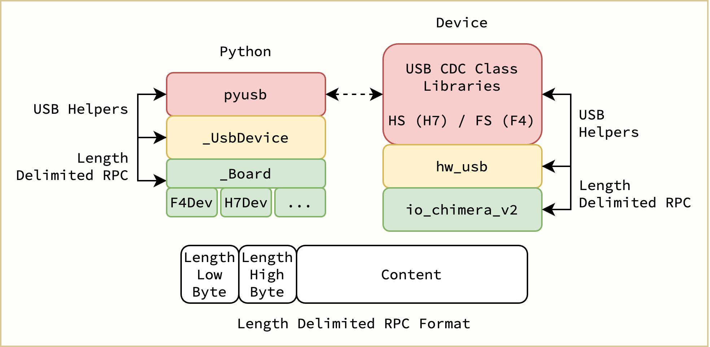

# Chimera V2
Control our STM boards over USB with Python.



*For user docs, see [`./docs/chimera_v2.md`](./docs/chimera_v2.md)*

## Quick Start
To install the `chimera_v2` Python package, run
```sh
pip install 'git+https://github.com/UBCFormulaElectric/Consolidated-Firmware.git@master#egg=chimera-v2&subdirectory=firmware/chimera_v2'
```

To output a quick 10Hz square wave over `GPIO 6` of the F4Dev board, 

```python
import time
import chimera_v2

# Config.
RATE_HZ = 10.0
DUTY_CYCLE = 0.5
LED_NET_NAME = "GPIO_6"

# Init device.
chimera_device = chimera_v2.F4Dev()

# Main loop.
while True:
    print("On")
    chimera_device.gpio_write(LED_NET_NAME, True)
    time.sleep(DUTY_CYCLE / RATE_HZ)

    print("Off")
    chimera_device.gpio_write(LED_NET_NAME, False)
    time.sleep((1.0 - DUTY_CYCLE) / RATE_HZ)
```
*From [`./examples/f4dev_blinky.py`](./examples/f4dev_blinky.py)*

## User Docs
For users of the `chimera_v2` Python package, checkout [`./docs/chimera_v2.md`](./docs/chimera_v2.md).

## Development
Chimera V2 has two ends - board side and Python side.

Board side code can be found at [`io_chimera_v2.h`](../shared/src/io/io_chimera_v2.h)/[`io_chimera_v2.c`](../shared/src/io/io_chimera_v2.c)

Python side code is in the [same directory as this README](.).

### Generated Files
To generate Proto libraries for Chimera, you can run [`./scripts/generate_proto.sh`](./scripts/generate_proto.sh).

To generate user docs, you can run [`./scripts/generate_docs.sh`](./scripts/generate_docs.sh).

Look inside both scripts for details on how they operate.

### USB Drivers
WIP