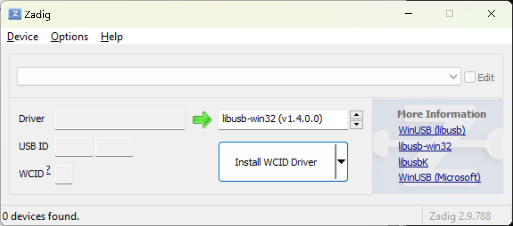
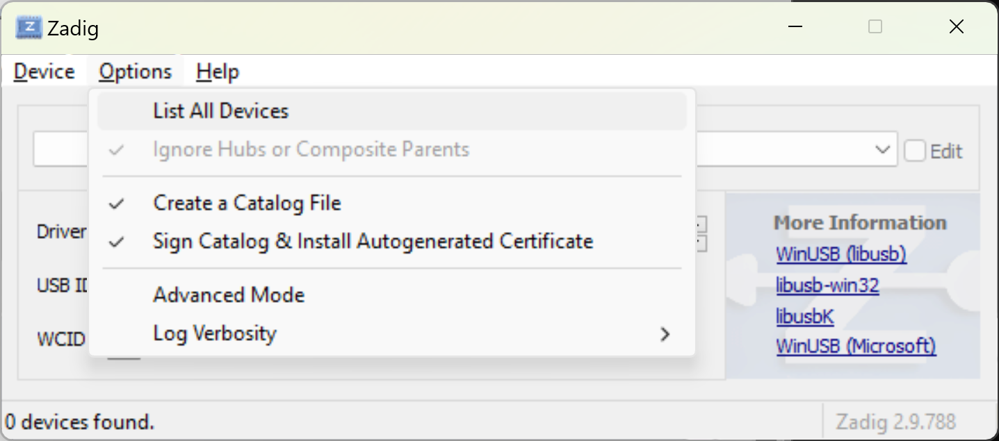
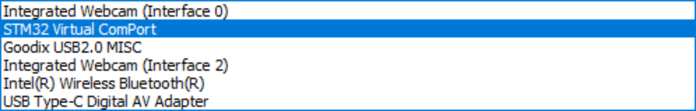
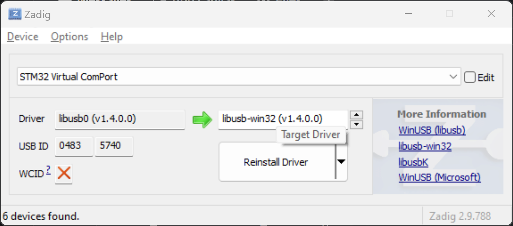
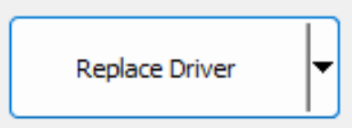

# Chimera V2
Control UBC Formula Electric STM boards over USB with Python.


*For Python API docs, see [`./docs/chimera_v2.md`](./docs/chimera_v2.md)*

## Quick Start
To install the `chimera_v2` Python package, run
```sh
pip install 'git+https://github.com/UBCFormulaElectric/Consolidated-Firmware.git@master#egg=chimera-v2&subdirectory=firmware/chimera_v2'
```

To output a quick 10Hz square wave over GPIO 6 of the F4Dev board, 

```python
import time
import chimera_v2

# Config.
RATE_HZ = 10.0
DUTY_CYCLE = 0.5
LED_NET_NAME = "GPIO_6"

# Init device.
chimera_device = chimera_v2.F4Dev()

# Main loop.
while True:
    print("On")
    chimera_device.gpio_write(LED_NET_NAME, True)
    time.sleep(DUTY_CYCLE / RATE_HZ)

    print("Off")
    chimera_device.gpio_write(LED_NET_NAME, False)
    time.sleep((1.0 - DUTY_CYCLE) / RATE_HZ)
```
*From [`./examples/f4dev_blinky.py`](./examples/f4dev_blinky.py)*

## For Windows Users
On Windows, you will need to install Zadig. Go to [https://zadig.akeo.ie/](https://zadig.akeo.ie/), and download the latest version.

When you open Zadig, you should see the following,


With the board plugged in over USB, click *List All Devices*. This will populate the central dropdown.


Select the STM32 device on the dropdown.


Then, in the menu pointed to by the green arrow, select *libusb-win32*. You will hae to use the up and down buttons near the box to cycle through your options.


Then click Replace Driver.


## User Docs
For users of the `chimera_v2` Python package, checkout [`./docs/chimera_v2.md`](./docs/chimera_v2.md).

## Development
Chimera V2 has two ends - board side and Python side. Board side code can be found at [`io_chimera_v2.h`](../shared/src/io/io_chimera_v2.h)/[`io_chimera_v2.c`](../shared/src/io/io_chimera_v2.c). Python side code is in the [same directory as this README](.).

### Configuring a New Device
WIP

### Generated Files
To generate Proto libraries for Chimera, you can run [`./scripts/generate_proto.sh`](./scripts/generate_proto.sh). To generate user docs, you can run [`./scripts/generate_docs.sh`](./scripts/generate_docs.sh). Look inside both scripts for details on how they operate.

### USB Drivers
Chimera V2 (unlike the original Chimera) is based on USB. The drivers can be found in [`hw_usb.h`](../shared/src/hw/hw_usb.h)/[`hw_usb.c`](../shared/src/hw/hw_usb.c).

We use the Communications Device Class (CDC) for our devices. This class takes 64 byte bulk input and output, which we convert to a continuous stream using a CMSIS `osMessageQueue` on the device side, and a buffer string on the Python side.

`hw_usb` exposes a `hw_usb_pushRxMsgToQueue` method, that must be called from the `CDC_Receive_FS` method in the STM32 autogenerated `usb_cdc_if.c` file.

eg. From the Quadruna F4Dev board,
```c
static int8_t CDC_Receive_FS(uint8_t *Buf, uint32_t *Len)
{
    /* USER CODE BEGIN 6 */
    USBD_CDC_SetRxBuffer(&hUsbDeviceFS, &Buf[0]);
    USBD_CDC_ReceivePacket(&hUsbDeviceFS);

    // hook to hw_usb
    hw_usb_pushRxMsgToQueue(Buf, *Len);

    return (USBD_OK);
    /* USER CODE END 6 */
}
```

> Note: F4s and H7s have different exposed USB APIs, since H7s support HS (high speed) and F4s support FS (full speed). If the receive callback on the F4 is called `CDC_Receive_FS`, it will be called `CDC_Receive_HS` on the H7.

