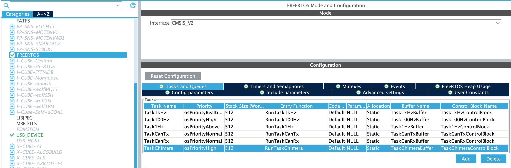

# Chimera V2

Control UBC Formula Electric STM boards over USB with Python.


*For Python API docs, see [`./docs`](./docs)*

*To see available peripherals by board, see the [`./proto`](./proto) directory.*

## Quick Start

To install the `chimera_v2` Python package, run

```sh
pip install 'git+https://github.com/UBCFormulaElectric/Consolidated-Firmware.git@master#egg=chimera-v2&subdirectory=firmware/chimera_v2'
```

To output a quick 10Hz square wave over GPIO 6 of the F4Dev board,

```python
import time
import chimera_v2

# Config.
RATE_HZ = 10.0
DUTY_CYCLE = 0.5
LED_NET_NAME = "GPIO_6"

# Init device.
chimera_device = chimera_v2.F4Dev()

# Main loop.
while True:
    print("On")
    chimera_device.gpio_write(LED_NET_NAME, True)
    time.sleep(DUTY_CYCLE / RATE_HZ)

    print("Off")
    chimera_device.gpio_write(LED_NET_NAME, False)
    time.sleep((1.0 - DUTY_CYCLE) / RATE_HZ)
```

*From [`./examples/f4dev_blinky.py`](./examples/f4dev_blinky.py)*

If you would like to use the `load_bank` or `power_supply` modules, you will also need to install
the [VISA drivers](https://www.ni.com/en/support/downloads/drivers/download.ni-visa.html).

```python
import power_supply
import time

# Config.
CHANNEL = 2
CURRENT = 1.51

# Setup supply.
supply = power_supply.DP821A()
print(supply.get_id())

# Output current for 5s.
supply.set_current(CURRENT, CHANNEL)
supply.enable_output(CHANNEL)
time.sleep(5)

# Measure voltage and current over channel 2 before disabling output.
current = supply.measure_current(CHANNEL)
voltage = supply.measure_voltage(CHANNEL)
print(f"Voltage: {voltage} V, Current: {current} A")

supply.disable_output()
```

*From [`./examples/power_supply.py`](./examples/power_supply.py)*

## Platform Instructions

### For Mac Users

Make sure you run your Chimera V2 scripts with `sudo`, ie. `sudo python ./examples/f4dev_blinky.py`.

### For Windows Users

On Windows, you will need to install Zadig. Go to [https://zadig.akeo.ie/](https://zadig.akeo.ie/), and download the
latest version.

When you open Zadig, you should see the following,


With the board plugged in over USB, click *List All Devices*. This will populate the central dropdown.


Select the STM32 device on the dropdown (will be named after the board you are connected to).


Then, in the menu pointed to by the green arrow, select *libusb-win32*. You will have to use the up and down buttons
near the box to cycle through your options.


Then click Replace Driver.


## User Docs

For users of this package, checkout [`./docs`](./docs).

## Development

Chimera V2 has two ends - board side and Python side. Board side code can be found at [
`hw_chimera_v2.h`](../shared/src/hw/hw_chimera_v2.h)/[`hw_chimera_v2.c`](../shared/src/hw/hw_chimera_v2.c). Python side
code is in the [same directory as this README](.).

### Versioning

Every change to Chimera V2 should correspond with a minor version bump. An update to support a new car should correspond
with a major version bump.

### Configuring a New Device

Open up the `.ioc` file of your board in STM32CubeMX, and search fot the `USB_DEVICE` setting. Set the device class to
`Communication Device Class (Virtual Port Com)`.

.

Then, under the *Device Descriptor* Panel, set `MANUFACTURER_STRING` to `ubc_formula_electric`, and `PRODUCT_STRING` to
the name of your board (we are enforcing a no-caps style here).

.

Then search for the `USB_OTG_FS` (or `USB_OTG_HS` on H7s) setting. Set the mode to `Device_Only`, and Activate_VBUS to
`Disable`.


> *Note for H7s*, make sure Activate_SOF is unchecked, and Internal FS Phy is set to `DEVICE_ONLY`.
> 

You should see two pins configured on the chip for USB,


Next, lets make a dedicated Chimera V2 task. Go to the FreeRTOS menu, and create the task.



Next, we need to make sure we build our binaries with all the USB dependencies. First, make sure that the call to
`stm32f412rx_cube_library`/`stm32h733xx_cube_library` has `TRUE` as it's last argument (this flag enables USB).

Eg.

```cmake
stm32h733xx_cube_library(
        "h7dev_stm32cube"
        "${STM32_HAL_SRCS}"
        "${SYSCALLS}"
        "${MD5_LOCATION}"
        TRUE
)
```

We also need to add to the passed HAL sources files required by USB.

For the H7, make sure you have

```cmake
"stm32h7xx_hal_pcd.c"
"stm32h7xx_hal_pcd_ex.c"
"stm32h7xx_ll_usb.c"
```

For the F4, make sure you have

```cmake
"stm32f4xx_hal_pcd.c"
"stm32f4xx_hal_pcd_ex.c"
"stm32f4xx_ll_usb.c"
```

Eg. From the F4Dev,

```cmake
...

set(STM32_HAL_SRCS
...
"stm32f4xx_hal_pcd.c"
"stm32f4xx_hal_pcd_ex.c"
"stm32f4xx_ll_usb.c"
)

stm32f412rx_cube_library(
"f4dev_stm32cube"
"${STM32_HAL_SRCS}"
"${MD5_LOCATION}"
TRUE
)

...
```

Try to build. This will regenerate all the STM32 code, with USB files setup.

Now find the generated `usbd_cdc_if.c` file. At the top, include [`hw_usb.h`](../shared/src/hw/hw_usb.h) and [
`io_log.h`](../shared/src/io/io_log.h).

```c
/* USER CODE BEGIN INCLUDE */
#include "hw_usb.h"
#include "io_log.h"
/* USER CODE END INCLUDE */
```

Next, find the defenition of `CDC_Receive_FS`/`CDC_Receive_HS`. Add a call to `hw_usb_pushRxMsgToQueue(Buf, *Len);` in
the body of the function.

Next, find HAL_PCD_ResumeCallback and HAL_PCD_SuspendCallback. Put `hw_usb_connect_callback()` and
`hw_usb_disconnect_callback()`
in the body of these functions. Ensure that it is in the user code section as to not have them deleted when code is
regenerated.

Eg. from the F4Dev,

```c
static int8_t CDC_Receive_FS(uint8_t *Buf, uint32_t *Len)
{
    /* USER CODE BEGIN 6 */
    USBD_CDC_SetRxBuffer(&hUsbDeviceFS, &Buf[0]);
    USBD_CDC_ReceivePacket(&hUsbDeviceFS);

    // Hook to hw_usb.
    if (!hw_usb_pushRxMsgToQueue(Buf, *Len))
        LOG_ERROR("Error encountered pushing USB RX Message to queue.");

    return (USBD_OK);
    /* USER CODE END 6 */
}
```

In the `main.c` of your board, you will need to initialize the `hw_usb` RX queue. To do this, go to where you init all
your peripherals, and call `hw_usb_init()` (you will need to include [`hw_usb.h`](../shared/src/hw/hw_usb.h) in `main.c`
well).

> Warning! `hw_usb_init()` creates a CMSIS OS Message Queue under the hood.
> Make sure to initialize after `osKernelInitialize` is called.

Next, you need to setup the protobuf messages for your board. Go to [`./proto`](./proto), and create a new `.proto` file
named after your board. It should look like this:

```proto
syntax = "proto3";

package name_of_board;

enum GpioNetName {
  GPIO_NET_NAME_UNSPECIFIED = 0;
}

enum AdcNetName {
  ADC_NET_NAME_UNSPECIFIED  = 0;
}

enum I2cNetName {
  I2C_NET_NAME_UNSPECIFIED = 0;
}

enum SpiNetName {
  SPI_NET_NAME_UNSPECIFIED = 0;
}
```

> Note: you do not need to include enums for peripherals that your board does not need. Eg. A board that has no SPI
> peripherals does not need to define `SpiNetName`

Now go into [`./proto/shared.proto`](./proto/shared.proto), and import your board's proto at the top of the file. In
`GpioNetName`, `AdcNetName`, `SpiNetName`, and `I2cNetName`, add your new board-specific enums.

Eg. With the CRIT configued (the CRIT has no I2C peripheral, so we do not need to update the `I2cNetName` enum):

```proto
...

import "crit.proto";

...

/* GPIOs */
message GpioNetName {
    oneof name {
        ...
        crit.GpioNetName crit_net_name = 3;
        ...
    }
}

...

/* ADCs */
message AdcNetName {
  oneof name {
    ...
    crit.AdcNetName crit_net_name = 1;
    ...
  }
}

...

/* SPIs */
message SpiNetName {
  oneof name {
    ...
    crit.SpiNetName crit_net_name = 1;
    ...
  }
}

...
```

To generate the Protobuf Python libraries, run [`./scripts/generate_proto.sh`](./scripts/generate_proto.sh).

The Protobuf C libraries will be exposed statically as `chimera_v2_proto_cm7` (H7s) and `chimera_v2_proto_cm4` (F4s).
Make sure to link the appropriate library into your binary.

Next, we need to add the board to [`./chimera_v2.py`](./chimera_v2.py). To do this, import the appropriate autogenerated
Python library, `proto_autogen.name_of_board_pb2`. Then, at the bottom, add a class for your board.

Eg. for the F4 Dev board,

```python
class F4Dev(_Board):
    def __init__(self):
        """Create an interface to an F4Dev board."""

        super().__init__(
            usb_device=_UsbDevice(product="f4dev"),
            net_name_tag="f4dev_net_name",
            board_module=proto_autogen.f4dev_pb2,
        )
```

Note: the `product` field in the `_UsbDevice` initializer is the same as you configured in STM32CubeMX.

The next step is to configure Chimera on the board. Open [`hw_chimera_v2.c`](../shared/src/hw/hw_chimera_v2.c). Modify
`hw_chimera_v2_getGpio`, `hw_chimera_v2_getAdc`, `hw_chimera_v2_getSpi`, and `hw_chimera_v2_getI2c` with a branch
corresponding to your board.

> Note: If your board does not have any of a given peripheral, do not add such a branch. Eg, a board with no SPI
> peripherals should not have a branch in `hw_chimera_v2_getSpi`.

eg. For `hw_chimera_v2_getGpio` on the F4Dev,

```c
...

static const Gpio *hw_chimera_v2_getGpio(const GpioNetName *net_name)
{
    ...

    if (net_name->which_name == GpioNetName_f4dev_net_name_tag)
        return id_to_gpio[net_name->name.f4dev_net_name];

    ...
}

...
```

Next, we need to add Chimera-controllable peripherals to the board. Open up the `.proto` file you made named after your
board (ie. [`./proto/f4dev.proto`](./proto/f4dev.proto)). Add an item to the enum for whatever type of peripheral you
want to set.

Eg. For a GPIO on the f4dev,

```proto
enum GpioNetName {
  GPIO_NET_NAME_UNSPECIFIED = 0;
  GPIO_6 = 1; // < Add a line like this.
}
```

> Note: We would like each item in the enum to be prefixed with the name of the peripheral, so items in `GpioNetName`
> should be prefixed with `GPIO_`, items in `I2cNetName` should be prefixed with `I2C_`, etc.

Now run [`./scripts/generate_proto.sh`](./scripts/generate_proto.sh) again to generate the python proto libraries. Also
try to build binaries for your board.

To capture these peripherals on the board side, we need to create a mapping from protobuf names to the actual GPIO
pins/ADC Channels. In the `hw` level of your board, create files called `hw_chimeraConfig_v2.h`/`hw_chimeraConfig_v2.c`.

`hw_chimeraConfig_v2.h` should look like this,

```c
#pragma once
#include "hw_chimera_v2.h"

// Exposed Chimera V2 configs.
extern hw_chimera_v2_Config chimera_v2_config;
```

`hw_chimeraConfig_v2.c` should declare an `hw_chimera_v2_Config` struct by the name `chimera_v2_config`.

Eg. On the CRIT,

```c
#include "crit.pb.h"
#include "shared.pb.h"
#include "hw_gpios.h"
#include "hw_spis.h"
#include "hw_chimeraConfig_v2.h"

// Chimera V2 enums to GPIO peripherals.
const Gpio *id_to_gpio[] = { [crit_GpioNetName_GPIO_BOOT]                 = &boot,
                             [crit_GpioNetName_GPIO_LED]                  = &led,
                             [crit_GpioNetName_GPIO_TELEM_SIG]            = &telem_sig,
                             [crit_GpioNetName_GPIO_PUSH_DRIVE_SIG]       = &push_drive_sig,
                             [crit_GpioNetName_GPIO_ROT_S]                = &rot_s,
                             [crit_GpioNetName_GPIO_ROT_B]                = &rot_b,
                             [crit_GpioNetName_GPIO_ROT_A]                = &rot_a,
                             [crit_GpioNetName_GPIO_LAUNCH_CONTROL_SIG]   = &launch_control_sig,
                             [crit_GpioNetName_GPIO_TORQUE_VECTORING_SIG] = &torque_vectoring_sig,
                             [crit_GpioNetName_GPIO_REGEN_SIG]            = &regen_sig,
                             [crit_GpioNetName_GPIO_LED_RCK]              = &led_rck,
                             [crit_GpioNetName_GPIO_SEVEN_SEG_RCK]        = &seven_seg_rck,
                             [crit_GpioNetName_GPIO_SEVEN_SEG_DIMMING]    = &seven_seg_dimming,
                             [crit_GpioNetName_GPIO_LED_DIMMING]          = &led_dimming };

const SpiDevice
    *id_to_spi[] = { [crit_SpiNetName_SPI_LED] = &led_spi, [crit_SpiNetName_SPI_SEVEN_SEG] = &seven_seg_spi };

hw_chimera_v2_Config chimera_v2_config = { .gpio_net_name_tag = GpioNetName_crit_net_name_tag,
                                           .id_to_gpio        = id_to_gpio,
                                           .spi_net_name_tag  = SpiNetName_crit_net_name_tag,
                                           .id_to_spi         = id_to_spi };
```

We can finally run chimera.

Include the shared `hw_chimera_v2.h` and `hw_chimeraConfig_v2.h` libraries in your `tasks.c`. Then, also in `tasks.c`,
create the following function.

```c
_Noreturn void tasks_runChimera(void)
{
    hw_chimera_v2_task(&chimera_v2_config);
}
```

You will also have to add the decleration in the `tasks.h` file.

```c
_Noreturn void tasks_runChimera(void);
```

Make sure to invoke this task function in `main.c`.

```c
void RunTaskChimera(void *argument)
{
    /* USER CODE BEGIN RunTaskChimera */
    /* Infinite loop */
    tasks_runChimera();
    /* USER CODE END RunTaskChimera */
}
```

Note: you will want to use the provided `hw_chimera_v2_enabled` flag to disable other non-Chimera jobs when Chimera is
running.

### Development Environment

For development, start by changing to [the directory of this README](.), and installing it as a pip package.

From the root of the project,

```sh
cd ./firmware/chimera_v2
pip install .
```

This will install a version of `chimera_v2` with all your local changes.

Open the examples directory, and write a quick example script to test Chimera out! See [
`./examples/f4dev_blinky.py`](./examples/f4dev_blinky.py) for an example.

Chimera is now ready to go 🥳!

### Generated Files

To generate Proto libraries for Chimera, you can run [`./scripts/generate_proto.sh`](./scripts/generate_proto.sh). To
generate user docs, you can run [`./scripts/generate_docs.sh`](./scripts/generate_docs.sh). Look inside both scripts for
details on how they operate.

> Note: Generating docs will reinstall/uninstall chimera_v2 on your system. It's a kink in the system to be ironed out
> later.

### USB Drivers

Chimera V2 (unlike the original Chimera) is based on USB. The drivers can be found in [
`hw_usb.h`](../shared/src/hw/hw_usb.h)/[`hw_usb.c`](../shared/src/hw/hw_usb.c).

We use the Communications Device Class (CDC) for our devices. This class takes 64 byte bulk input and output, which we
convert to a continuous stream using a CMSIS `osMessageQueue` on the device side, and a buffer string on the Python
side.

`hw_usb` exposes a `hw_usb_pushRxMsgToQueue` method, that must be called from the `CDC_Receive_FS` method in the STM32
autogenerated `usb_cdc_if.c` file.

> Note: F4s and H7s have different exposed USB APIs, since H7s support HS (high speed) and F4s support FS (full speed).
> If the receive callback on the F4 is called `CDC_Receive_FS`, it will be called `CDC_Receive_HS` on the H7.

### Linting

See [`./scripts/lint.sh`](./scripts/lint.sh).